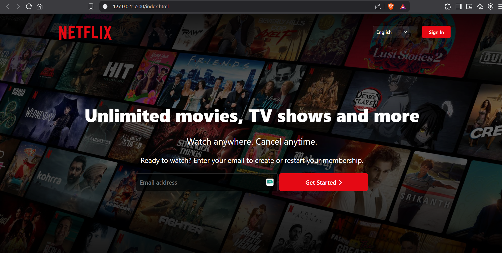
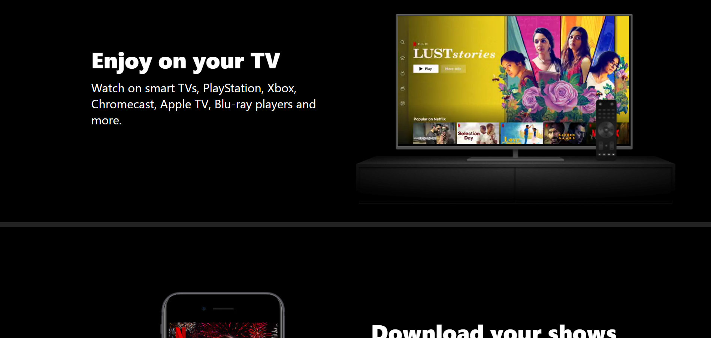
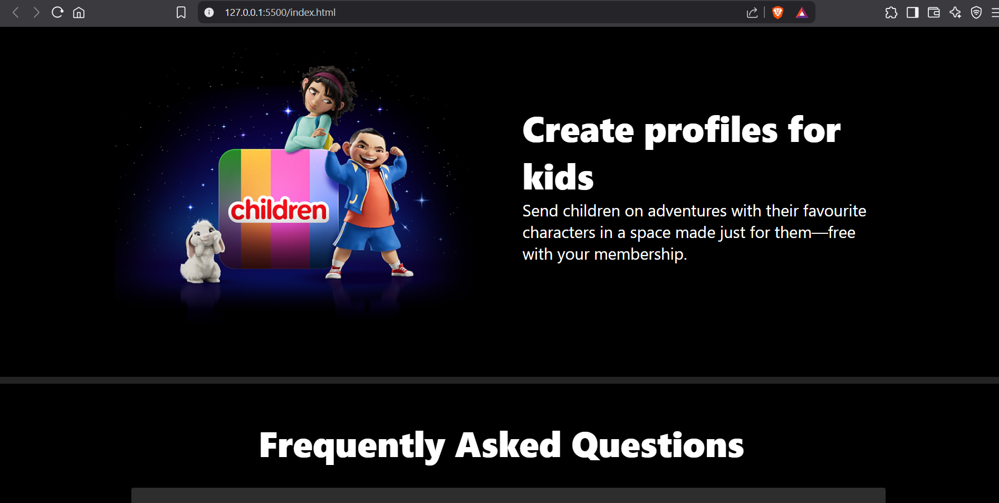

# 🎬 Netflix Landing Page Clone

A fully responsive clone of the Netflix landing page built using **HTML, CSS, and jQuery**.  
Includes smooth dropdown animations using `slideToggle()` to mimic modern UI behavior.

## 📸 Screenshot
<ol>
  <li>
    
Landing page

    
  </li>
  <li>
    
Sections

    
  </li>
  <li>
    
Sections

    
  </li>
</ol>

## 🧑‍💻 Tech Stack

- ✅ HTML5
- ✅ CSS3
- ✅ jQuery (for dropdown animation)
- ✅ Manual media queries (no frameworks like Bootstrap)

## 📌 Project Highlights

- Pixel-perfect layout inspired by Netflix
- Fully responsive for desktop, tablet, and mobile
- Smooth dropdown menu with jQuery animation
- Clean, structured, and scalable code

## ⚙️ Features

- Responsive Navbar
- SlideToggle dropdown for menu (jQuery)
- Flexbox layout
- Custom responsive design (no frameworks)

